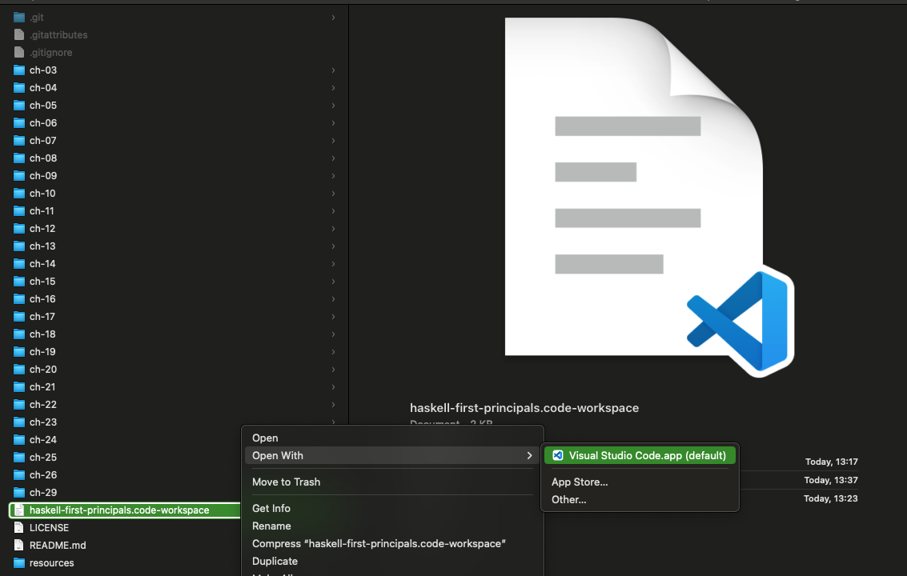
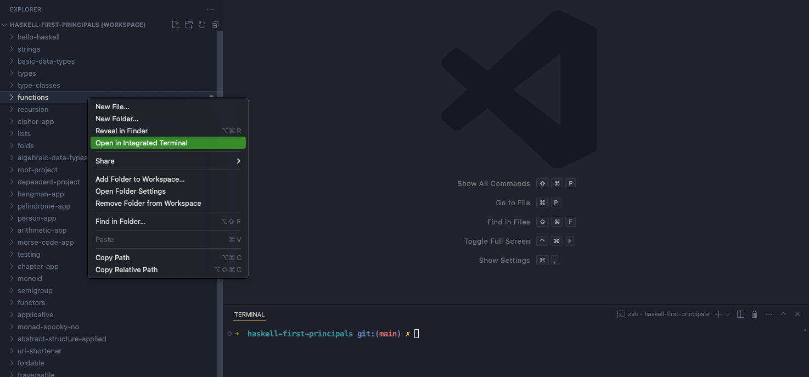
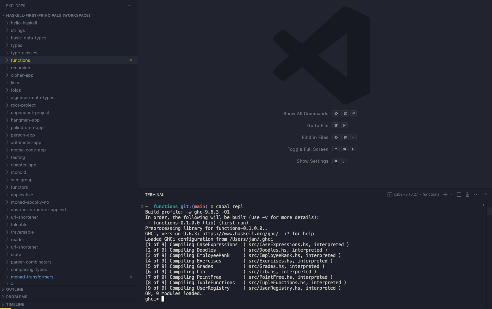
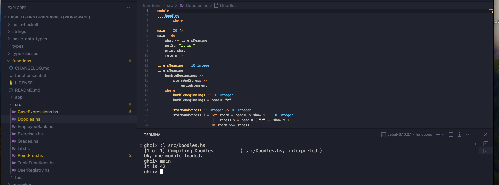
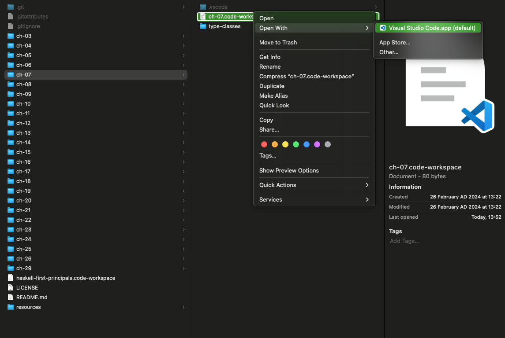
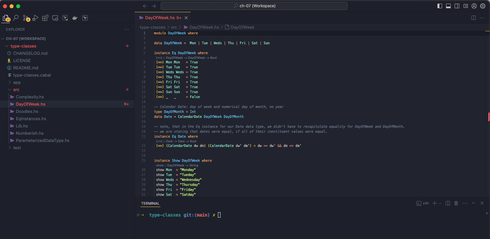
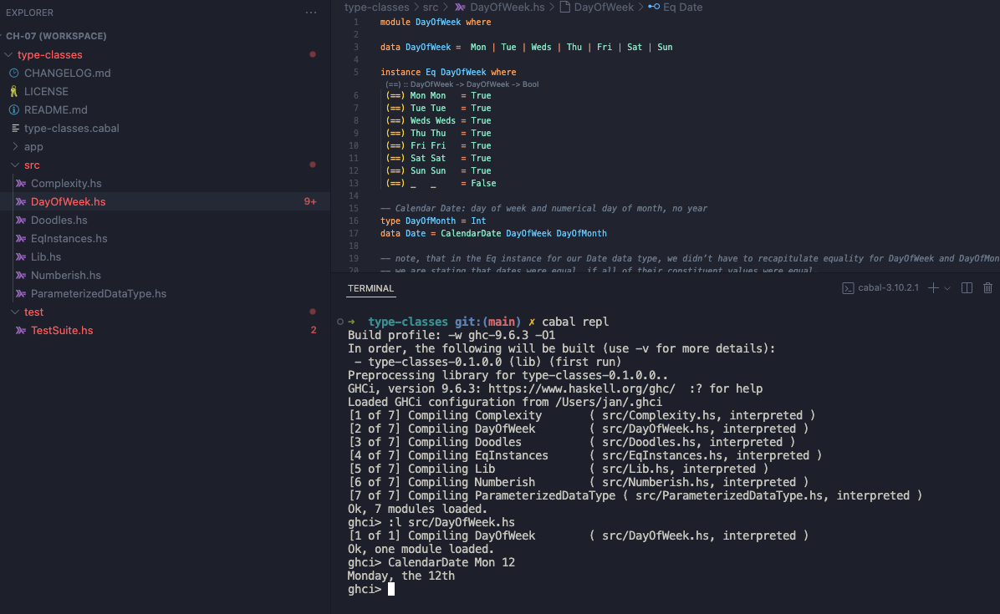

# haskell-first-principals
 
#### Notes taken while working through [Chris Allen's amazing Haskell Book](https://haskellbook.com/)  

### open all as a single project:

---

---

---

 

### open one at a time

---

---

